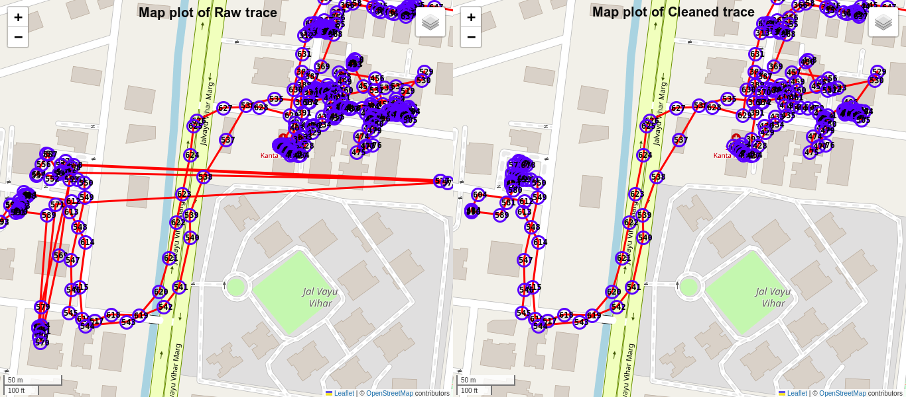
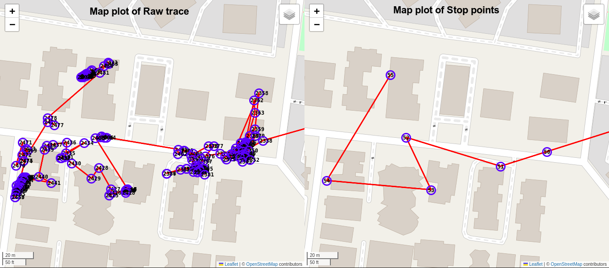
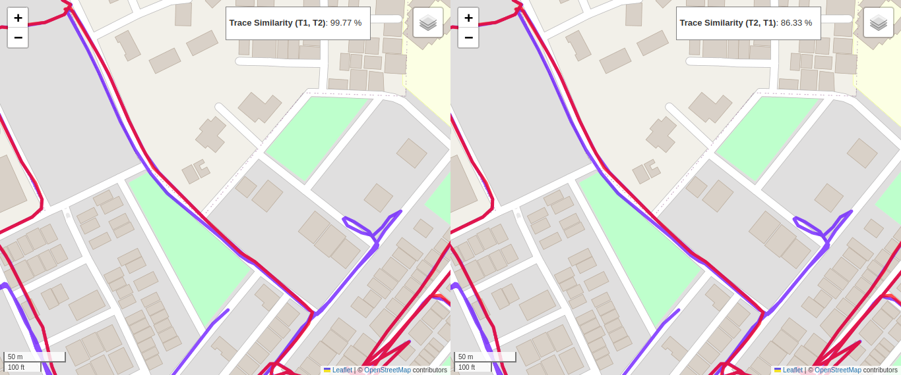

# Tracely

Tracely is a python library that aims to provide following capabilities for trace data:

* Remove noise in the GPS/location ping data by providing following cleaning techniques:
    * Conditionally remove pings that are close to the previous ping. Users can set `force_retain` to True for a ping if they want a ping to be forcefully retained.
    * Impute outlier pings on the basis of distance and direction.

* Generate summary:
    * Cleaning summary: In output data, provide `cleaning_summary` to indicate the number of not null pings in input and output, along with other information.
    * Distance summary: In output data, provide `distance_summary` to indicate distance in raw and cleaned data, also the reduction in distance.
    * Stop summary: In output data, provide `stop_summary` to provide information about inferred stop events.

* Enrich sequential ping data:
    * Provide metrics on time and distance gap between two pings
    * Provide cumulative time and distance up to the respective ping.
    * Provide details that which function modified the ping most recently and the type of operation.

* Visualization:
    * Provide visualization capabilities, so that users can plot maps of individual pings or dual maps to compare two ping sequences, and visually inspect them.


# Ping, Trace data and Trace payload
## Ping 

A ping is a single data entry that represents a specific location at a given time, with optional details. It consists of:

### Mandatory Fields:
- **Latitude**: Decimal degree format within the range [-90, 90]. It may also be `None`.
- **Longitude**: Decimal degree format within the range [-180, 180]. It may also be `None`.
- **Timestamp**: A Unix timestamp in milliseconds.

### Optional Fields:
- **Ping ID**: Unique identifier for the current ping.<br>Note: Ping ID must be present in either all of the pings or user can choose to not pass it in any of the pings. We will automatically assign a unique string for each ping.
- **Error Radius**: A measure of GPS/location accuracy in meters. Defaults to `None`.
- **Event Type**: A string indicating an event associated with the ping. Defaults to `None`.
- **Force Retain**: A boolean flag that ensures the ping is not dropped during cleaning if set to `True`. Defaults to `False`.
- **Metadata**: An optional dictionary that can store extra information about the ping, with customizable keys and values. Defaults to empty dictionary

This structure allows for capturing both the essential location and time details, as well as optional data like id, event, error, force retention or meta information of ping.

- **Example:**  {"latitude": 19.052407, "longitude": 73.074993, "timestamp": 1706874347094, "ping_id": "1", 
"error_radius": 11.01, "event_type": "event_a", "force_retain": True, "metadata": {"id": 289811}}

## Trace data
Trace data is sequence of multiple pings. Together, these pings represent a journey.

## Trace payload 
Trace data is a dictionary that has following key and information:
- **trace**: This key contains trace data.
- **vehicle_type**: This key contains a string denoting type of vehicle. Defaults to "car"
- **vehicle_speed**: This key contains a number denoting the speed of vehicle. Defaults to 25 (km/hr)
Note: Apart from validation, **vehicle_type** and **vehicle_speed** information is not utilized in Tracely's operations.


# Important Resources

* Input format for CleanTrace Class: [Link](assets/docs/Tracely%20I_O%20Structure%20-%20input%20for%20CleanTrace%20class.pdf)
* Input format for calculate_trace_similarity method: [Link](assets/docs/Tracely%20I_O%20Structure%20-%20input%20for%20calculate_trace_similarity%20method.pdf)
* Output format of get_trace_cleaning_output method: [Link](assets/docs/Tracely%20I_O%20Structure%20-%20output%20of%20get_trace_cleaning_output%20method.pdf)
* Output format of calculate_trace_similarity method: [Link](assets/docs/Tracely%20I_O%20Structure%20-%20output%20of%20calculate_trace_similarity%20method.pdf)
* Exception handling document: [Link](assets/docs/Tracely%20I_O%20Structure%20-%20exception_handling.pdf)
* Function's documentation: [Link](assets/docs/functions_documentation.md)


# Installing Tracely
   Create an environment with python 3.11 and activate the python environment and run following commands. Then you can use the [usage example](#usage) directly.

   ```python
   >>> git clone https://github.com/delhivery/tracely.git
   >>> cd tracely
   >>> sudo chmod +x install_tracely.sh
   >>> ./install_tracely.sh
   >>> python -m examples.trace_cleaning_example
   >>> python -m examples.stop_summary_example
   >>> python -m examples.trace_similarity_example
   ```


# OSRM dependency

A user can setup osrm from official osrm-backend repository.
- Installation link: `https://github.com/Project-OSRM/osrm-backend`
- Usage folder: `osrm/osrm-backend/build/`
- Usage command: `./osrm-routed --max-matching-size=10000 india-latest.osrm`

Additionally, we have also provided a helper script `install_osrm.sh` using which a user can easily setup an osrm docker for their desired OSM map file. For example the following commands allow you to setup an osrm container named "northern_india_osrm" for northern India on port "7000". 

  ```python
  >>> sudo chmod +x ./install_osrm.sh
  >>> ./install_osrm.sh northern_india_osrm 7000 https://download.geofabrik.de/asia/india/northern-zone-latest.osm.pbf
  >>> sudo docker start northern_india_osrm
  >>> curl 'http://localhost:7000/route/v1/driving/77.2090,28.6139;77.1025,28.7041?overview=false'
  >>> sudo docker stop northern_india_osrm
  ```


# Usage
  * User can generate trace payload from a CSV file, create CleanTrace object and apply its methods. Example usage:
      ```python
      from tracely.utils.input_output_utils import convert_csv_to_trace_payload
      from tracely.clean_trace import CleanTrace
      payload = convert_csv_to_trace_payload("file_path.csv")

      # Create CleanTrace object
      clean_trace_object = CleanTrace(payload)
      
      # Get raw output
      raw_output = clean_trace_object.get_trace_cleaning_output()
      raw_trace = raw_output["cleaned_trace"]
      
      # Apply some CleanTrace methods
      clean_trace_object.remove_nearby_pings()
      clean_trace_object.impute_distorted_pings_with_distance()
      
      # Get cleaned output
      clean_output = clean_trace_object.get_trace_cleaning_output()
      clean_trace = clean_output["cleaned_trace"]
      ```
    * Minimum requirement to create trace payload from a CSV file(using `convert_csv_to_trace_payload` function) is that it should contain at least "latitude", "longitude" and "timestamp" columns.

  * User can apply CleanTrace's `plot_cleaning_comparison_map` method to get `folium.plugins.DualMap` object containing two traces. Example usage:
      ```python
      # Get comparison map plot for raw and clean trace (created in above example)
      map_object = clean_trace_object.plot_cleaning_comparison_map(raw_trace, clean_trace)
      ```
    * Example map illustration  
      

  * User can add stop events information with CleanTrace's `add_stop_events_info` method, and get `folium.plugins.DualMap` object, containing raw trace and trace formed by stop pings. Example usage:
      ```python
      # Add stop event information in trace
      clean_trace_object.add_stop_events_info()
      
      # Get comparison map plot for raw trace and stop pings trace
      map_object = clean_trace_object.plot_raw_vs_stop_comparison_map()
      ```
    * Example map illustration      
      

  * User can calculate the similarity between two traces and optionally visualize the traces using the `calculate_trace_similarity` method. Example usage:
      ```python
      from tracely.clean_trace import CleanTrace

      # Define two traces with their respective latitudes, longitudes, and timestamps
      trace_1 = [
          [28.6139, 77.2090, 1706874347094],
          [28.7041, 77.1025, 1706874348094],
          # Add more points as needed
      ]
      trace_2 = [
          [28.6140, 77.2095, 1706874347094],
          [28.7030, 77.1030, 1706874348094],
          # Add more points as needed
      ]

      # Define thresholds for distance and time
      distance_threshold = 50  # meters
      time_threshold = 1000    # milliseconds

      # Calculate trace similarity
      similarity_result = CleanTrace.calculate_trace_similarity(trace_1, trace_2, distance_threshold, time_threshold, plot_map=True)
      ```
    * Example map illustration      
      

# Contact
In case of any issues or suggestions, reach out at: tracely@delhivery.com
